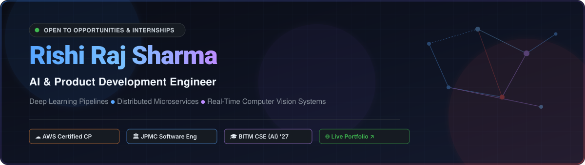

<!-- Header Banner -->

 

<!-- Dynamic Typing SVG Headline -->

  
  
  
  

---

### 👨‍💻 About Me

I am an **AI & Product Development Engineer** pursuing my B.E. in **Computer Science & Engineering (Artificial Intelligence)** at **Ballari Institute of Technology and Management (BITM)**, Karnataka (2023 – 2027). 

I build resilient, production-ready engineering systems at the intersection of **deep learning pipelines**, **distributed microservices architectures**, and **real-time computer vision**.

- 🚀 **High-Throughput Machine Learning**: Engineered NLP classification pipelines benchmarked at `<140ms` latency using transformer architectures (`DistilRoBERTa`) and Google GenAI.
- ⚙️ **Enterprise Distributed Systems**: Designed scalable microservice ecosystems with Spring Boot & Spring Cloud (Eureka discovery, Reactive Gateway, Zipkin tracing, JWT security).
- 👁️ **Computer Vision & HCI**: Built real-time gesture-driven touchless interfaces operating at `30 FPS` with OpenCV and deep 2D Convolutional Neural Networks.
- ☁️ **Cloud & Industry Rigor**: **AWS Certified Cloud Practitioner**; completed enterprise software engineering simulations with JPMorgan Chase & Co. and Finacle enterprise training.

---

### 🏛️ Flagship Engineering Projects

<table>
  <tr>
    <td width="50%" valign="top">
      <h3>📰 <a href="https://github.com/Risshhhiiii/Comments-Sentiment-Analysis-And-Summarizer---Newsroom-AI">Newsroom AI — Sentiment & Emotion Pipeline</a></h3>
      
High-throughput NLP pipeline analyzing multi-source public discussions across 7 psychological emotion dimensions, synthesized with automated GenAI executive briefings.

      <ul>
        <li><b>NLP Classification:</b> Fine-grained emotion classification via <code>j-hartmann/emotion-english-distilroberta-base</code>.</li>
        <li><b>GenAI Synthesis:</b> Executive news summaries generated via Google Gemini API.</li>
        <li><b>Performance:</b> Asynchronous FastAPI backend delivering sub-<code>140ms</code> response times with MongoDB persistence.</li>
      </ul>
      

        
        
        
        
        
      

      

        <a href="https://github.com/Risshhhiiii/Comments-Sentiment-Analysis-And-Summarizer---Newsroom-AI"><b>View Source Repository →</b></a>
      

    </td>
    <td width="50%" valign="top">
      <h3>🏥 <a href="https://github.com/Risshhhiiii/Hospital-Management-System-Using-MicroServices-And-SpringBoot">Hospital Management — Microservices Platform</a></h3>
      
Enterprise-grade decentralized healthcare infrastructure engineered on Spring Boot and Spring Cloud microservices architecture.

      <ul>
        <li><b>Routing & Discovery:</b> Dynamic service registry via Netflix Eureka (Port 8761) paired with Reactive Spring Cloud Gateway (Port 9191).</li>
        <li><b>Security & Tracing:</b> Downstream JWT authentication, header propagation, and end-to-end request tracing via Zipkin, Brave, & Micrometer.</li>
        <li><b>Resilience:</b> Non-blocking inter-service communication with Spring WebClient and PostgreSQL persistence.</li>
      </ul>
      

        
        
        
        
        
      

      

        <a href="https://github.com/Risshhhiiii/Hospital-Management-System-Using-MicroServices-And-SpringBoot"><b>View Source Repository →</b></a>
      

    </td>
  </tr>
  <tr>
    <td width="50%" valign="top">
      <h3>🎮 <a href="https://github.com/Risshhhiiii/CNN-Based-Media-Player">Touchless Media Player — Real-Time CNN Vision</a></h3>
      
Real-time touchless Human-Computer Interface (HCI) driving complete media playback through deep Convolutional Neural Networks and computer vision.

      <ul>
        <li><b>Vision Engine:</b> <code>30 FPS</code> live video pipeline performing background subtraction, skin-masking, and hand contour segmentation.</li>
        <li><b>Inference:</b> 2D CNN posture classifier converting dynamic hand gestures into playback, volume, and seeking actions with zero contact.</li>
        <li><b>Interface:</b> Lightweight, interactive Streamlit frontend with instantaneous control feedback.</li>
      </ul>
      

        
        
        
        
        
      

      

        <a href="https://github.com/Risshhhiiii/CNN-Based-Media-Player"><b>View Source Repository →</b></a>
      

    </td>
    <td width="50%" valign="top">
      <h3>🌌 <a href="https://my-portfolio-tau-navy-48.vercel.app/">Cinematic Tsukuyomi Portfolio & AI Intelligence</a></h3>
      
Interactive web engineering showcase featuring GPU-accelerated WebGL shaders, Mangekyō gaze constellation tracking, and embedded AI intelligence.

      <ul>
        <li><b>Visual Engineering:</b> Custom WebGL smoke & particle shaders, mouse-tracking geometry, and Web Audio API soundscape synthesis.</li>
        <li><b>Architecture:</b> Engineered with React 19, TypeScript, and Vite for 60 FPS fluid rendering.</li>
        <li><b>Live AI Guard:</b> Integrated intelligent persona trained on telemetry and system architecture.</li>
      </ul>
      

        
        
        
        
        
      

      

        <a href="https://my-portfolio-tau-navy-48.vercel.app/"><b>Experience Live Demo ↗</b></a> · <a href="https://github.com/Risshhhiiii/My-Portfolio"><b>Repository →</b></a>
      

    </td>
  </tr>
</table>

---

### 🛠️ Technical Arsenal

| Domain | Technologies & Frameworks |
| :--- | :--- |
| **🧠 AI, Machine Learning & Vision** | `TensorFlow` `Keras` `PyTorch` `OpenCV` `Hugging Face` `DistilRoBERTa` `Google Gemini API` `Scikit-Learn` `NumPy` `Pandas` |
| **⚙️ Backend & Distributed Systems** | `Spring Boot` `Spring Cloud (Gateway, Eureka)` `FastAPI` `Django` `RESTful APIs` `Microservices` |
| **💾 Databases & Storage** | `PostgreSQL` `MongoDB` `MySQL` |
| **☁️ Cloud, DevOps & QA** | `AWS (Certified Cloud Practitioner)` `Docker` `Postman` `Apache JMeter` `JUnit` `Git` `GitHub Actions` `Linux` |
| **💻 Programming Languages** | `Python` `Java` `C++` `SQL` `JavaScript (ES6+)` `HTML5 / CSS3` |

 

  

---

### 📜 Industry Certifications & Credentials

- ☁️ **AWS Certified Cloud Practitioner** — *Amazon Web Services (2026)*  
  Verified mastery of AWS Cloud architectural principles, IAM security, VPC networking, EC2/S3 compute and scalable cloud deployments.
- 🏛️ **Software Engineering Job Simulation** — *JPMorgan Chase & Co. / Forage (2026)*  
  Engineered financial data feeds, interface development, and enterprise code quality practices.
- 🧠 **Generative AI Foundations** — *AWS Academy (2026)*  
  LLM architectures, foundational prompt engineering, and generative application design.
- 🏦 **Finacle Enterprise Banking Certification Training** — *EdgeVerve / Infosys (2026)*  
  Enterprise core banking infrastructure, PostgreSQL persistence, Spring Framework, and load testing with JMeter & JUnit.
- 🏆 **VISAI 2026 – 16th International Project Competition**  
  Presented Newsroom AI (real-time sentiment and emotion classification system) in a competitive global hackathon forum.
- 🎖️ **NCC 'B' Certificate** — *National Cadet Corps*  
  Combined Annual Training Camp (CATC), drill leadership, and disciplined team coordination.

---

### 📊 GitHub Activity & Telemetry

  <table border="0">
    <tr>
      <td align="center">
        
      </td>
      <td align="center">
        
      </td>
    </tr>
    <tr>
      <td colspan="2" align="center">
        
      </td>
    </tr>
  </table>

---

### 📬 Let's Connect & Collaborate

Whether you're looking to discuss **AI/ML system architectures**, **distributed microservices engineering**, or **full-time/internship opportunities**, my inbox is always open.

  
  &nbsp;&nbsp;
  
  &nbsp;&nbsp;
  
  &nbsp;&nbsp;
  

  Designed &amp; engineered by <b>Rishi Raj Sharma</b> · Built for performance, clarity, and precision.

