  

  <!-- Typing SVG inspired by DenverCoder1 -->
  

<!-- Social & Action Badges -->

  
  &nbsp;
  
  &nbsp;
  
  &nbsp;
  
  &nbsp;
  

<!-- Live Telemetry KPI Dashboard -->
<table align="center" border="0" cellpadding="8">
  <tr align="center">
    <td><b>⚡ &lt; 140ms</b> NLP Inference Latency</td>
    <td><b>👁️ 30 FPS</b> Real-Time Gesture Loop</td>
    <td><b>⚙️ Microservices</b> Spring Cloud Gateway + Eureka</td>
    <td><b>☁️ AWS Certified</b> Cloud Practitioner (2026)</td>
    <td><b>🎓 BITM Ballari</b> CSE – AI Engineering '27</td>
  </tr>
</table>

---

## 👨‍💻 Executive Summary

AI & Product Development Engineer experienced in machine learning and full-stack development. Skilled in **Python**, **Java**, **TensorFlow**, **Spring Boot**, and building scalable, data-driven applications. Strong problem-solving abilities with a focus on developing efficient, intelligent, and product-oriented solutions.

* 🎓 **Education**:
  * **Ballari Institute of Technology and Management (BITM)** — *Bachelor in Engineering (B.E.) in CSE – AI Engineering (2023 – 2027)*
  * **Jindal Vidya Mandir** — *Intermediate: Physics, Chemistry, Mathematics, Computer Science (2021 – 2023)*
* 🌐 **Live Interactive Portfolio**: Experience the full digital sanctuary with WebGL shaders, gesture telemetry, and live Itachi AI intelligence at **[my-portfolio-tau-navy-48.vercel.app](https://my-portfolio-tau-navy-48.vercel.app/)**.
* 🎯 **Core Specializations**: High-throughput ML pipelines, distributed enterprise microservices, real-time computer vision (30 FPS), and cloud-native system design.

---

## 🏛️ Flagship Engineering Projects

<table>
  <tr>
    <td width="50%" valign="top">
      <h3>📰 <a href="https://github.com/Risshhhiiii/Comments-Sentiment-Analysis-And-Summarizer---Newsroom-AI">Comments Sentiment Analysis & Summarizer — NEWSROOM AI</a></h3>
      
<b>Status:</b> Production Ready &nbsp;·&nbsp; <b>Latency:</b> &lt; 140ms &nbsp;·&nbsp; <b>Hackathon:</b> VISAI 2026

      
High-throughput NLP pipeline analyzing multi-source public discussions across 7 psychological emotion dimensions, synthesized with automated GenAI executive briefings.

      <ul>
        <li><b>NLP Classification:</b> Fine-grained emotion classification using <code>j-hartmann/emotion-english-distilroberta-base</code> transformer model.</li>
        <li><b>GenAI Synthesis:</b> Executive news summaries generated via Google GenAI (Gemini API) for fast, structured insights.</li>
        <li><b>Async Ingestion:</b> Scalable backend with FastAPI integrating YouTube Data API and News API for real-time ingestion.</li>
        <li><b>Storage:</b> Low-latency retrieval and storage using MongoDB clusters (&lt;140ms response).</li>
      </ul>
      

        
        
        
        
        
      

      <h4>Pipeline Architecture Flow:</h4>
      <pre>
[User Comments / News API / YouTube API]
                 │ Real-time Stream
                 ▼
     [Asynchronous FastAPI Engine]
        │                      │
        ▼                      ▼
[DistilRoBERTa Emotion]   [Google Gemini GenAI]
 (7 Emotion Vectors)      (Executive Briefing)
        │                      │
        └──────────┬───────────┘
                   ▼
      [MongoDB Cluster Storage] (&lt;140ms Latency)
      </pre>
      
<a href="https://github.com/Risshhhiiii/Comments-Sentiment-Analysis-And-Summarizer---Newsroom-AI"><b>Inspect Repository &amp; Source Code →</b></a>

    </td>
    <td width="50%" valign="top">
      <h3>🏥 <a href="https://github.com/Risshhhiiii/Hospital-Management-System-Using-MicroServices-And-SpringBoot">Hospital Management — Microservices Platform</a></h3>
      
<b>Architecture:</b> Distributed Microservices &nbsp;·&nbsp; <b>Routing:</b> Spring Cloud Gateway

      
Decentralized healthcare infrastructure engineered with Spring Boot, Spring Cloud, dynamic service discovery, and end-to-end distributed observability.

      <ul>
        <li><b>Service Registry:</b> Dynamic routing &amp; discovery using Netflix Eureka (Port 8761) paired with Reactive Spring Cloud Gateway (Port 9191).</li>
        <li><b>Inter-Service Resilience:</b> Non-blocking inter-service communication with Spring WebClient and PostgreSQL persistence.</li>
        <li><b>Distributed Observability:</b> End-to-end request tracing via Zipkin, Brave, and Micrometer with downstream JWT propagation.</li>
      </ul>
      

        
        
        
        
        
      

      <h4>Distributed Microservices Topology:</h4>
      <pre>
[Client Request / Frontend]
             │
             ▼
[Spring Cloud Gateway :9191] ──► [JWT Auth Filter]
             │
             ▼
┌──────────────────────────────────────────────┐
│       Netflix Eureka Registry :8761          │
└──────────────┬──────────────┬────────────────┘
               │              │
      ┌────────┴────────┐     └────────┐
      ▼                 ▼              ▼
[Doctor Service]  [Patient Service] [Appointment Service]
      │                 │              │
      └─────────┬───────┴──────────────┘
                ▼
  [PostgreSQL DB + Distributed Zipkin Tracing]
      </pre>
      
<a href="https://github.com/Risshhhiiii/Hospital-Management-System-Using-MicroServices-And-SpringBoot"><b>Inspect Repository &amp; Source Code →</b></a>

    </td>
  </tr>
  <tr>
    <td width="50%" valign="top">
      <h3>🎮 <a href="https://github.com/Risshhhiiii/CNN-Based-Media-Player">CNN-Based Touchless Media Controller</a></h3>
      
<b>Throughput:</b> 30 FPS Live Stream &nbsp;·&nbsp; <b>Model:</b> 2D CNN (.h5) &nbsp;·&nbsp; <b>Interface:</b> Streamlit

      
Real-time touchless Human-Computer Interface (HCI) translating dynamic hand postures into media playback commands with zero physical contact.

      <ul>
        <li><b>Computer Vision:</b> Real-time 30 FPS video streaming, hand contour detection, and dynamic skin-mask segmentation via OpenCV.</li>
        <li><b>Gesture Classification:</b> Trained 2D CNN model to detect hand postures with high reliability for play, pause, volume, and seek controls.</li>
        <li><b>Integration:</b> Combined ML inference pipeline with media player state logic in an interactive Streamlit application.</li>
      </ul>
      

        
        
        
        
        
      

      <h4>Gesture Recognition Loop:</h4>
      <pre>
[Live Webcam Feed (30 FPS)]
             │
             ▼
[OpenCV Skin-Masking &amp; Hand Contour Extraction]
             │
             ▼
[2D CNN Classifier (.h5 Inference Loop)]
             │
   ┌─────────┼──────────┬──────────┐
   ▼         ▼          ▼          ▼
[Play]    [Pause]   [Volume ±]   [Seek]
      </pre>
      
<a href="https://github.com/Risshhhiiii/CNN-Based-Media-Player"><b>Inspect Repository &amp; Source Code →</b></a>

    </td>
    <td width="50%" valign="top">
      <h3>🌌 <a href="https://my-portfolio-tau-navy-48.vercel.app/">Cinematic Tsukuyomi Portfolio &amp; AI Intelligence</a></h3>
      
<b>Performance:</b> 60 FPS WebGL &nbsp;·&nbsp; <b>Deployment:</b> Vercel &nbsp;·&nbsp; <b>Persona:</b> Tsukuyomi AI

      
Interactive web engineering showcase featuring GPU-accelerated WebGL shaders, Mangekyō constellation tracking, and embedded AI intelligence.

      <ul>
        <li><b>Visual Engineering:</b> Custom WebGL smoke &amp; particle shaders, mouse-tracking geometry, and Web Audio API soundscapes.</li>
        <li><b>Architecture:</b> Built with React 19, TypeScript, and Vite for smooth 60 FPS rendering.</li>
        <li><b>Live AI Guard:</b> Tsukuyomi guardian persona trained on architecture, projects, and engineering telemetry.</li>
      </ul>
      

        
        
        
        
        
      

      <h4>Frontend Stack Highlights:</h4>
      <ul>
        <li><b>Hardware-Accelerated:</b> Shaders executed directly on GPU canvas with zero lag.</li>
        <li><b>Interactive Knowledge Base:</b> Ask Itachi persona questions regarding Rishi's system designs.</li>
        <li><b>Full Responsiveness:</b> Engineered for desktop, tablet, and mobile displays.</li>
      </ul>
      

        <a href="https://my-portfolio-tau-navy-48.vercel.app/"><b>Experience Live Demo ↗</b></a> &nbsp;·&nbsp; <a href="https://github.com/Risshhhiiii/My-Portfolio"><b>Repository →</b></a>
      

    </td>
  </tr>
</table>

---

## 🛠️ Technical Arsenal & Tools

### 👨‍💻 Programming Languages

  
  
  
  
  
  
  

### 🧠 AI, Deep Learning & Computer Vision

  
  
  
  
  
  
  
  

### ⚙️ Frameworks & Distributed Systems

  
  
  
  
  
  

### 🗄️ Databases & Storage

  
  
  

### ☁️ Cloud, DevOps, Testing & Tooling

  
  
  
  
  
  
  

  

---

## 📜 Industry Certifications & Accolades

* ☁️ **AWS Certified Cloud Practitioner** — *Amazon Web Services (June 2026)*  
  Certified in core AWS cloud architectural principles, IAM security, VPC networking, compute (EC2/Lambda), and cloud deployment models.
* 🏛️ **JPMorgan Chase & Co. Software Engineering Job Simulation** — *Forage (June 2026)*  
  Completed simulation on enterprise software development, financial data feed processing, interface development, and code quality.
* 🧠 **AWS Academy – Generative AI Foundations** — *AWS Academy (March 2026)*  
  Completed foundational training in large language model (LLM) architectures, prompt engineering, and generative application design.
* ⚙️ **Infosys Finacle Certification Training** — *Edgeverve (Infosys) (2026)*  
  Completed comprehensive technical training in **PostgreSQL**, **Spring Framework**, **JUnit**, and **Apache JMeter** performance testing; currently pursuing JavaScript training as part of the program.
* 🏆 **VISAI 2026 – 16th International Project Competition**  
  Presented Newsroom AI (real-time sentiment &amp; emotion classification system) in a competitive global hackathon forum.
* 🎖️ **NCC (National Cadet Corps)**  
  Completed **NCC 'B' Certificate**; actively participated in Combined Annual Training Camp (CATC), drill leadership, and team coordination.

---

## 📊 Stats and Real-Time Telemetry

<table border="0">
  <tr>
    <td align="center" valign="middle">
      
    </td>
    <td align="center" valign="middle">
      
    </td>
  </tr>
  <tr>
    <td colspan="2" align="center" valign="middle">
      
    </td>
  </tr>
</table>

  

---

## 📬 Let's Connect & Collaborate

Feel free to reach out to discuss **machine learning systems**, **distributed architectures**, or **opportunities & collaborations**:

  
  &nbsp;&nbsp;
  
  &nbsp;&nbsp;
  
  &nbsp;&nbsp;
  

  Engineered by <b>Rishi Raj Sharma</b> · BITM Ballari (2023 – 2027)

